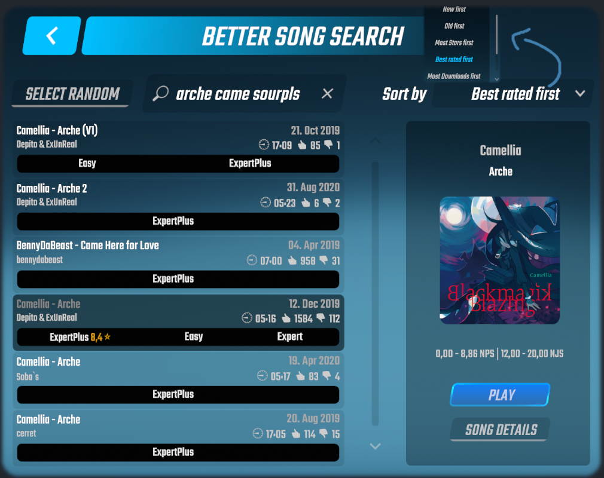
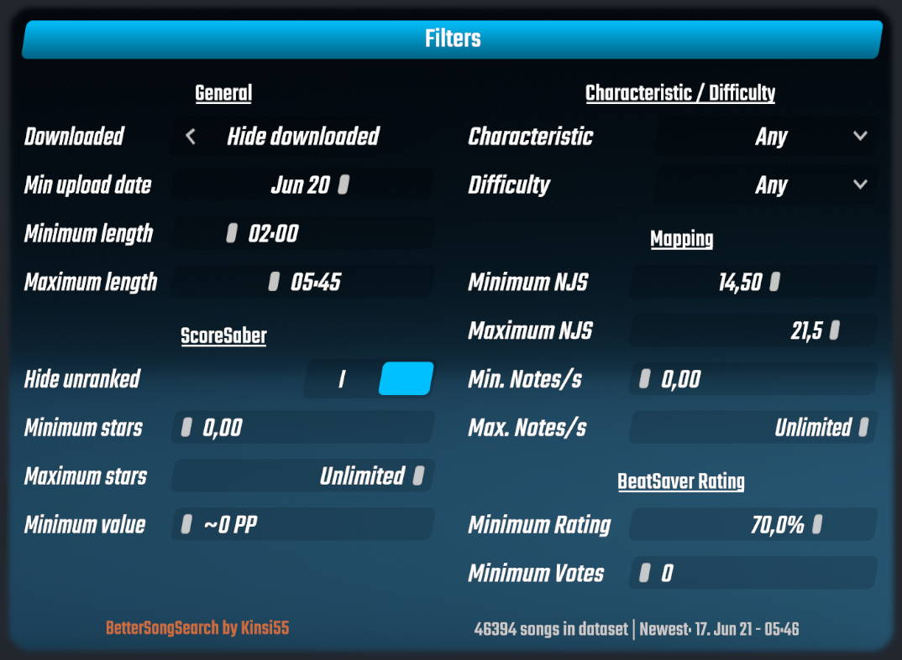
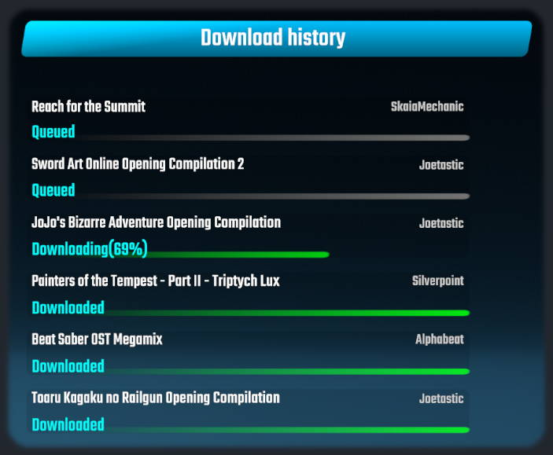

# Better Song Search

Searching, downloading and playing songs, now with 100% less annoying!

---

The Game version(s) specific releases are compatible with are mentioned in the Release title (Its obviously possible latest is not supported assuming its been released recently). If you need the plugin for an older version - Grab an older release that fits 🤯

## Install

#### You can always find the latest download in [The Releases](https://github.com/kinsi55/BeatSaber_BetterSongSearch/releases), simply drag the files into the respective folders

### Requirements

- [SongDetailsCache](https://github.com/kinsi55/BeatSaber_SongDetails/releases/latest) (Available in ModAssistant)
- BeatSaberMarkupLanguage (Available in ModAssistant)
- SongCore (Available in ModAssistant)

## Features

- Wide variety of [filtering / searching and sorting options](#Screenshots) & the ability to create / load filter presets
- Absolute banger of a UI that gives you as much information as possible at a single glance
- Preview of Songs that you havent downloaded yet 😮
- Uses a locally cached database (Via SongDetailsCache) so all inputs are reflected instantly-ish at the cost of being **unable to find songs which have been uploaded in the last couple of hours**
- **Accessible while in a Multiplayer lobby!**
- Button to pick random songs based off your filter settings if you're trying to discover new stuff
- Download queue / history which is kept until the game is closed
- Songs can directly be played from the search, no need to manually look for them after downloading
- If downloads fail for some reason they are retried

## Screenshots

Main Screen | Filters | Download History
:-------------------------:|:-------------------------:|:-------------------------:
 |   |  

## Planned Features

- Possibly persisting the download history across game restarts? Not sure if really necessary
